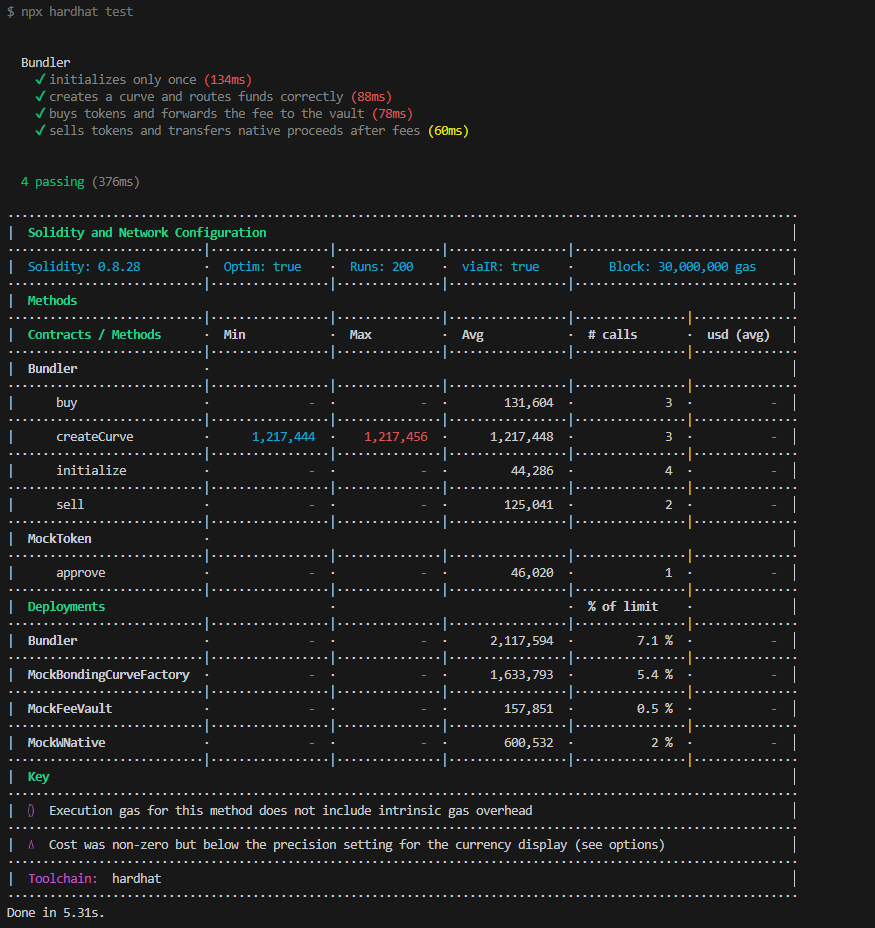

# 💊 nad.fun bundler

`nad.fun bundler` is a Pump.fun-inspired bundler that runs entirely on Monad’s EVM-compatible. It lets anyone launch viral tokens, route buys and sells through a bonding curve, and migrate mature pools onto Uniswap liquidity—without leaving the Solidity/Hardhat toolchain.


## 🔍 Repo tour

| Path | Purpose |
| --- | --- |
| `contracts/Core.sol` | Main router for buys, sells, slippage-protected orders, and fee routing. |
| `contracts/Bundler.sol` | Deploys bonding-curve instances and orchestrates launch/migration flows. |
| `contracts/utils/*` | Math helpers, safe transfer libs, and native-asset handling. |
| `contracts/interfaces/*` | Minimal ABI surface for frontends, scripts, and auditors. |
| `scripts/createAndBuy.ts` | Example Hardhat script that deploys, buys, and prints receipts. |


## ✨ Feature set

- **One-click launches** – deploy a bonding curve, seed reserves, and mint supply in one transaction.
- **Bundled buys** – ETH deposit, fee capture, reserve math, and token mint happen atomically.
- **Sell variations** – standard sells, permit-based sells, and slippage-protected variants.
- **Fee vaulting** – protocol fees stream to a vault contract for later withdrawal.
- **Liquidity migration hooks** – once thresholds are met, liquidity can hop to Uniswap pools.
- **Safety rails** – transfer helpers, allowance checks, bonding-curve math guards, and deadlines.


## ⚙️ Quick start

1. **Install**
   ```bash
   npm install
   ```
2. **Configure**
   ```bash
   cp .env.example .env
   ```
3. **Compile**
   ```bash
   npx hardhat compile
   # or
   npm run build
   ```
4. **Test**
   ```bash
   npx hardhat test
   # or
   npm run test
   ```
5. **Demo script**
   ```bash
   ts-node scripts/createAndBuy.ts
   ## or
   npm run createAndBuy
   ```


## 🔄 Runtime flow

1. **Launch**: `Bundler` deploys curve + token contracts, initializes virtual reserves, and records config.
2. **Buy**: `Core` calculates amountOut via `BondingCurveLibrary`, mints tokens, forwards ETH, and sweeps protocol fees.
3. **Sell**: Users transfer tokens into the curve; `Core` unwraps WNative, sends ETH out, and routes fees to the vault.
4. **Protect**: `protectBuy` and `protectSell` enforce min/max outputs to guard against slippage.
5. **Migrate**: Once the curve hits its liquidity threshold, prepared hooks move liquidity to Uniswap (future expansion).


## 🌐 Networks

`hardhat.config.ts` ships with:

- `monadMainnet` – `https://rpc.monad.xyz` (chain ID `143`)
- `monadTestnet` – `https://testnet-rpc.monad.xyz` (chain ID `10143`)

Add your `PRIVATE_KEY` to the `.env` file so scripts and deployments can sign transactions.


## 🧪 Tests & artifacts

- `test/Bundler.test.ts` exercises the new Bundler contract end-to-end (curve creation, buys, sells, fees). A fresh Hardhat run is documented in `screenshot.png`.
- Artifacts for each interface/contract can be found under `artifacts/`.
- Unit Test Result



## 🍵 Tip

### If you are interested in my projects, please [🔗fork](https://github.com/xbuilders7/nadfun-bundler/fork) or give me ⭐star
